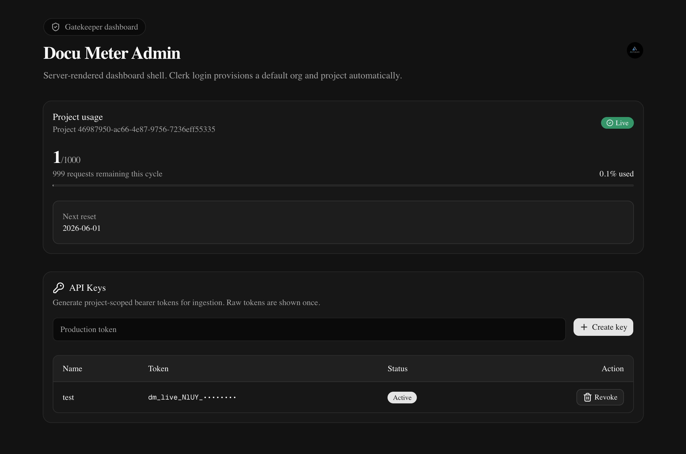
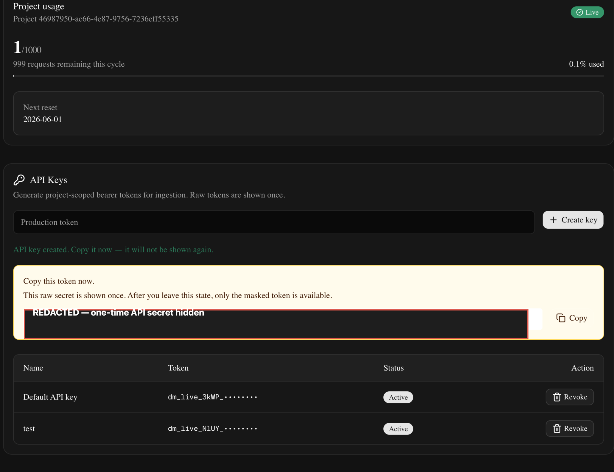
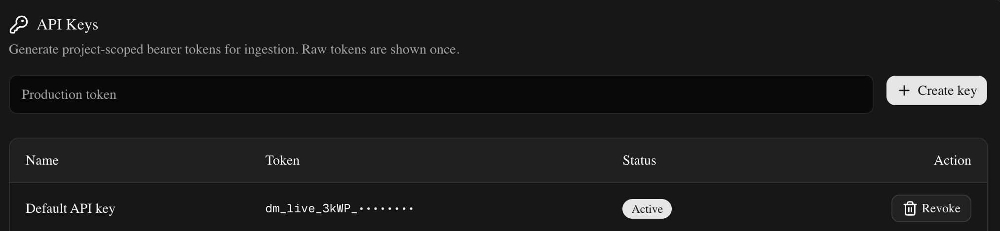

<div align="center">

# Docu Meter API

### Universal API auth, quota, and metering engine for AI/document services

[](https://fastapi.tiangolo.com/)
[](https://nextjs.org/)
[](https://www.postgresql.org/)
[](https://redis.io/)
[](https://docs.docker.com/compose/)
[](LICENSE)

</div>

**Docu Meter is a production-style developer API platform:** API keys, HMAC-secured secret storage, Redis rate limits, monthly project quotas, Postgres usage metering, and a Next.js control plane for developer self-service.

The included flagship service is an LLM-powered document analyzer, but the core platform is intentionally generic. You can plug in web scraping, weather data, enrichment APIs, data fetching, image processing, internal tools, or any other microservice and immediately get secure API keys, quota control, durable metering, and dashboard visibility.

Docu Meter gives any backend service a reusable request ladder:

```text
API key identity → Redis rate limit → project quota → service execution → Postgres usage metrics
```

The included flagship service is an LLM-powered document analyzer, but the core platform is intentionally generic. You can plug in web scraping, weather data, enrichment APIs, data fetching, image processing, internal tools, or any other microservice and immediately get secure API keys, quota control, durable metering, and dashboard visibility.

---

## Why this exists

Most demo API projects stop at “here is an endpoint.” Real API products need the boring-but-critical platform layer:

- Who is calling?
- Is the key valid and active?
- Is this project over rate limit?
- Is this project over monthly quota?
- Did this request succeed?
- How many billable units should we track?
- Can the dashboard show usage without leaking secrets?

Docu Meter answers those questions with a clean FastAPI + Next.js + Postgres + Redis stack.

---

## Architecture value

### HMAC-SHA-256 identity guard

Customer API keys are high-entropy bearer tokens. Raw keys are shown once and never stored. The backend stores only a prefix plus an HMAC-SHA-256 digest using a server-side pepper.

This means a database leak does **not** expose usable customer API keys.

### Redis 7 quota safety valve

Redis powers project-scoped fixed-window rate limiting before expensive service work runs. The protected ladder rejects abusive or over-limit traffic before calling LLMs or other costly integrations.

### Postgres 15 persistent metrics tracking

Postgres stores durable platform state:

- users
- organizations
- projects
- API keys
- usage events
- project usage counters

The Docker stack uses a named `pgdata` volume so data survives container restarts.

### Next.js dashboard

The dashboard provides a developer-facing control plane for:

- Clerk auth
- zero-touch workspace provisioning
- project usage visibility
- API key creation
- one-time secret disclosure
- masked key display
- key revocation

---

## Visual proof

Authenticated dashboard screenshots are included under `docs/assets/`:







---

## Stack

| Layer | Tech |
|---|---|
| API | FastAPI, SQLAlchemy, Alembic, Pydantic |
| Web | Next.js, TypeScript, Clerk |
| Database | Postgres 15 |
| Rate limiting | Redis 7 |
| LLM service | OpenAI-compatible analyzer |
| Infra | Docker Compose |
| Tests | pytest, ruff, ESLint, Next build |

---

## 1-command startup

```bash
git clone git@github.com:Oussamcsc/docu-meter-api.git
cd docu-meter-api
cp .env.example .env
# Fill in OPENAI_API_KEY and Clerk keys for full dashboard/auth behavior.
docker compose up --build
```

Services:

- Web dashboard: <http://localhost:3001>
- API: <http://localhost:8000>
- API docs: <http://localhost:8000/docs>
- Postgres 15: internal Docker service `db:5432`
- Redis 7: internal Docker service `redis:6379`

The API container automatically runs:

```bash
alembic upgrade head
```

before starting Uvicorn, so a fresh clone builds the Postgres schema automatically.

---

## Environment setup

Copy the example file:

```bash
cp .env.example .env
```

Important values:

```env
DATABASE_URL=postgresql+psycopg://docu_meter:docu_meter_password@db:5432/docu_meter
REDIS_URL=redis://redis:6379/0
API_KEY_PEPPER=replace-with-a-64-character-random-hex-string
ADMIN_API_TOKEN=replace-with-a-random-admin-token
OPENAI_API_KEY=replace-with-openai-api-key
NEXT_PUBLIC_CLERK_PUBLISHABLE_KEY=replace-with-clerk-publishable-key
CLERK_SECRET_KEY=replace-with-clerk-secret-key
```

Generate a local API key pepper:

```bash
python -c "import secrets; print(secrets.token_hex(32))"
```

---

## Persistence

Postgres data is stored in the named Docker volume `pgdata`, so users, projects, API keys, and usage survive container restarts.

Reset local Docker data:

```bash
docker compose down -v
```

Postgres and Redis are intentionally not published to host ports by default. This avoids collisions with local Postgres/Redis installs while still allowing the API container to reach them over the Compose network.

---

## Built-in document analyzer

The default protected service is a customer-facing document processing endpoint:

```http
POST /v1/documents/process
Authorization: Bearer <api_key>
Content-Type: application/json
```

Example body:

```json
{
  "filename": "contract.txt",
  "content": "This service agreement starts on June 1..."
}
```

Request ladder:

```text
Bearer API key
  → HMAC digest lookup
  → active key check
  → project-scoped Redis rate limit
  → monthly project quota check
  → document extraction / validation
  → LLM analysis
  → usage metering in Postgres
  → dashboard usage update
```

---

## Universal integration pattern

The platform is not limited to documents. Any service can reuse the same identity, safety, and metering ladder.

Example: adding a generic data-fetching or scraping-style service.

```python
from fastapi import APIRouter, Depends, HTTPException
from pydantic import BaseModel, HttpUrl
from sqlalchemy.orm import Session

from app.api_keys.models import ApiKey
from app.core.database import get_db
from app.protected_api.dependencies import require_api_key
from app.quotas.service import enforce_project_quota
from app.rate_limits.dependencies import enforce_project_rate_limit
from app.rate_limits.service import RateLimitResult
from app.usage.service import record_usage

router = APIRouter(prefix="/v1", tags=["generic-services"])


class FetchRequest(BaseModel):
    url: HttpUrl


class FetchResponse(BaseModel):
    project_id: str
    status: str
    units: int
    result: dict


async def run_external_service(url: str) -> dict:
    # Replace this with scraping, weather lookup, enrichment, ML inference,
    # PDF conversion, internal automation, or any other service logic.
    return {"source": url, "title": "Example fetched result"}


@router.post("/data/fetch", response_model=FetchResponse)
async def fetch_data(
    payload: FetchRequest,
    api_key: ApiKey = Depends(require_api_key),
    _rate_limit: RateLimitResult = Depends(enforce_project_rate_limit),
    _quota: None = Depends(enforce_project_quota),
    db: Session = Depends(get_db),
) -> FetchResponse:
    try:
        result = await run_external_service(str(payload.url))
    except Exception as exc:
        raise HTTPException(status_code=502, detail="External service failed") from exc

    units = 1
    record_usage(
        db,
        api_key=api_key,
        endpoint="/v1/data/fetch",
        units=units,
        llm_response={"service": "data_fetch", "result": result},
    )

    return FetchResponse(
        project_id=api_key.project_id,
        status="processed",
        units=units,
        result=result,
    )
```

That one route instantly gets:

- bearer API key auth
- active/revoked key enforcement
- project-scoped Redis rate limiting
- monthly quota protection
- Postgres usage events
- dashboard usage updates

This is the core product: **bring your own service logic; Docu Meter handles the API-platform layer.**

---

## Local non-Docker fallback

The backend still supports SQLite for quick local experiments. In `apps/api/.env`, use:

```env
DATABASE_URL=sqlite:///./docu_meter.db
REDIS_URL=redis://localhost:6379/0
```

Then run the API from `apps/api`:

```bash
uv run alembic upgrade head
uv run uvicorn app.main:app --reload
```

---

## Development checks

Backend:

```bash
cd apps/api
uv run ruff check app tests alembic
uv run pytest
```

Frontend:

```bash
cd apps/web
npm run lint
npm run build
```

Docker:

```bash
docker compose config
docker compose up --build
```

---

## Current status

Implemented and verified:

- FastAPI protected API
- Next.js dashboard shell
- Clerk-backed dashboard auth flow
- zero-touch internal user/org/project provisioning
- HMAC-SHA-256 API key storage
- API key creation/listing/revocation
- Redis project rate limiting
- project monthly quota checks
- Postgres usage event tracking
- LLM document analyzer service
- Dockerized FastAPI + Next.js + Postgres 15 + Redis 7
- Alembic auto-migrations on API container startup
- persistent Postgres volume
- SQLite fallback for non-Docker local development

---

## License

MIT — intended as a public, portfolio-grade API platform foundation.
